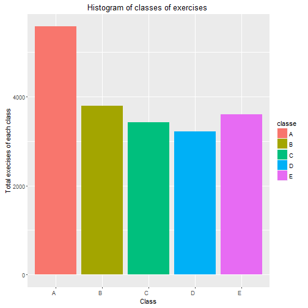

###Synopsys


The goal of this project is to predict the "classe" variable that defines the manner in which 6 participants did the exercise. For this purpose data from accelerometers on the belt, forearm, arm, and dumbell were analyzed.After cleaning and preprocessing data output was trained agains 21 predictors. 3 models were applied for predicition -  tree, linear discriminant analysis  and boosting with trees . According to analyzis, The best model is 'boosting with trees'. It makes predictions with accuracy around 0.93.


###Data Processing


```r
library(caret);library(tree);library(randomForest);library(plyr);library(dplyr)
```

```
## Loading required package: lattice
## Loading required package: ggplot2
```

```
## Warning: package 'ggplot2' was built under R version 3.2.3
```

```
## Stackoverflow is a great place to get help:
## http://stackoverflow.com/tags/ggplot2.
## randomForest 4.6-12
## Type rfNews() to see new features/changes/bug fixes.
## 
## Attaching package: 'randomForest'
## 
## The following object is masked from 'package:ggplot2':
## 
##     margin
## 
## 
## Attaching package: 'dplyr'
## 
## The following objects are masked from 'package:plyr':
## 
##     arrange, count, desc, failwith, id, mutate, rename, summarise,
##     summarize
## 
## The following object is masked from 'package:randomForest':
## 
##     combine
## 
## The following objects are masked from 'package:stats':
## 
##     filter, lag
## 
## The following objects are masked from 'package:base':
## 
##     intersect, setdiff, setequal, union
```

```r
library(MASS)
```

```
## 
## Attaching package: 'MASS'
## 
## The following object is masked from 'package:dplyr':
## 
##     select
```

```r
cache = TRUE
data<-read.csv("pml-training.csv")
datatst<-read.csv("pml-testing.csv")
dm <- dim(data)
tstclass <- "classe"  %in%  names(datatst)

for(i in 1:length(names(data))){
    b<-(data[,i])
    b[as.character(b) =="#DIV/0!"| as.character(b)==""]=NA
    data[,i] = b}

exfeat<- NULL
for (i in 1:length(names(data))){ 
    if(sum(is.na(data[,i]))/length(data[,i])>0.75){
        exfeat<- c(exfeat,i)
        }
    }
data1 <- data[,-exfeat]
datatst1 <- datatst[,-exfeat]

dm1 <- dim(data1)
count <- length(exfeat)
output<-which(names(data1)=="classe")
for (i in 3:(length(names(data1))-1)){  data1[,i]= as.numeric(data1[,i])}
for (i in 3:(length(names(datatst1))-1)){  datatst1[,i]= as.numeric(datatst1[,i])}
```
The original training data set contains 19622 observations of 160  variables. The data set  "pml-testing.csv" does not contain "classe" column and can't be used for evaluation models.
The following figure shows histogram of variable "classe" in training data set. 


```r
#create histogram of classes
fig1<-data%>% group_by(classe) %>% summarise(totalclass = n())
ggplot(fig1, aes(x=classe, y=totalclass, fill = classe)) +
    geom_bar(stat="identity")+theme(axis.text.x = element_text(angle = 0,hjust = 1))+
   xlab("Class") +ylab("Total execises of each class")+ ggtitle ("Histogram of classes of exercises ")
```

 


100 columns contain more than 75% 'NA' values. 
After excluding these variables, the data set contains 60  variables.
Split the training data set into the training, validation and testing sets to evaluate the model.


```r
set.seed(35)
inTrain<-createDataPartition(y=data1$classe,p=0.95,list = FALSE)
trainvalid<-data1[inTrain,]
trainVal <- createDataPartition(trainvalid$classe,p=0.95,list = FALSE)
training<-trainvalid[trainVal,]
valid <- trainvalid[-trainVal,]
test<-data1[-inTrain,]
truetest<-datatst1
```
###Preprocessing data

Choose the least amount of predictors using "scale", "center", "principal component analysis" and "near zero variance" methods that could capture 90% of the variation in data.


```r
pc<-preProcess(training[,-output], method = c("scale","center","nzv","pca"), thresh = 0.90)
pcacmp <-pc$numComp
```

21  components are needed to capture 90% of the variation in data

###Compute new variables for 21 principal components for the data sets for building and evaluating a model


```r
trainpc<-predict(pc, training[,-output])
validpc<-predict(pc, valid[,-output])
testpc<-predict(pc, test[,-output])
truetestpc<-predict(pc,truetest[,-output])
```

###create models: tree, linear discriminant analysis model and boosting with trees model Evaluate accuracy of the models on the validation data set


```r
#tree
tr <- tree(training$classe ~., data = trainpc)
plot(tr, main = "Plot of Tree Model")
```

 

```r
trpr <- prune.tree(tr)
plot(trpr, main = "Size of Tree vs Error\n")
```

 

```r
#predict on the validation data set
predvalid<- predict(tr, newdata = validpc, type = "class")
#calculate accuracy for validation set
errortr <-sum(predvalid==valid[,output])/length(predvalid)

#linear discriminant analysis model-lda
lda <- train(training$classe~.,data = trainpc, method="lda")
#predict on the validation data set
predvallda<-predict(lda, newdata = validpc, type = "raw")
#calculate accuracy for the validation set
errorlda <-sum(predvallda==valid[,output])/length(predvallda)
gbm<-train(training$classe~.,data = trainpc, method="gbm", verbose = F)
```

```
## Loading required package: gbm
```

```
## Warning: package 'gbm' was built under R version 3.2.4
```

```
## Loading required package: survival
## 
## Attaching package: 'survival'
## 
## The following object is masked from 'package:caret':
## 
##     cluster
## 
## Loading required package: splines
## Loading required package: parallel
## Loaded gbm 2.1.1
```

```r
predvalgbm<-predict(gbm, newdata = validpc, type = "raw")
errorgbm <-sum(predvalgbm==valid[,output])/length(predvalgbm)
```

###Analyze accuracy and test the best model on the test data set


```r
models<-c(tr,lda,gbm )
modelaccur<-c(errortr, errorlda, errorgbm)
names(modelaccur)<-c("tree","lda", "gbm")
modelaccur
```

```
##      tree       lda       gbm 
## 0.5473118 0.9043011 0.9215054
```

```r
#define the best model
bestmodel<-names(modelaccur)[which(modelaccur == max(modelaccur))]
bestmodel
```

```
## [1] "gbm"
```

```r
#test the best model on the testing data sets
testpred<-predict(gbm, newdata = testpc, type = "raw")
accurtst<-sum(testpred==test[,output])/length(test[,output])
```

According to analysis, the best model is gbm. Accuracy on the testing 
data set is 0.9090909
Confusion matrix for the best model for the test data set:


```r
confusionMatrix(test$classe, testpred)
```

```
## Confusion Matrix and Statistics
## 
##           Reference
## Prediction   A   B   C   D   E
##          A 270   9   0   0   0
##          B  11 164  12   1   1
##          C   1  17 149   4   0
##          D   0   1  14 141   4
##          E   0   1   2  11 166
## 
## Overall Statistics
##                                           
##                Accuracy : 0.9091          
##                  95% CI : (0.8893, 0.9264)
##     No Information Rate : 0.288           
##     P-Value [Acc > NIR] : < 2.2e-16       
##                                           
##                   Kappa : 0.8849          
##  Mcnemar's Test P-Value : NA              
## 
## Statistics by Class:
## 
##                      Class: A Class: B Class: C Class: D Class: E
## Sensitivity            0.9574   0.8542   0.8418   0.8981   0.9708
## Specificity            0.9871   0.9682   0.9726   0.9769   0.9827
## Pos Pred Value         0.9677   0.8677   0.8713   0.8812   0.9222
## Neg Pred Value         0.9829   0.9646   0.9653   0.9805   0.9937
## Prevalence             0.2880   0.1961   0.1808   0.1604   0.1747
## Detection Rate         0.2758   0.1675   0.1522   0.1440   0.1696
## Detection Prevalence   0.2850   0.1931   0.1747   0.1634   0.1839
## Balanced Accuracy      0.9723   0.9112   0.9072   0.9375   0.9767
```
 
