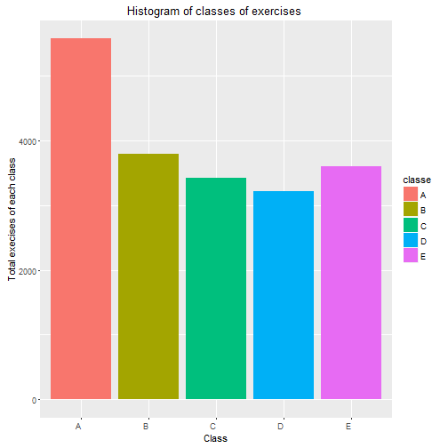
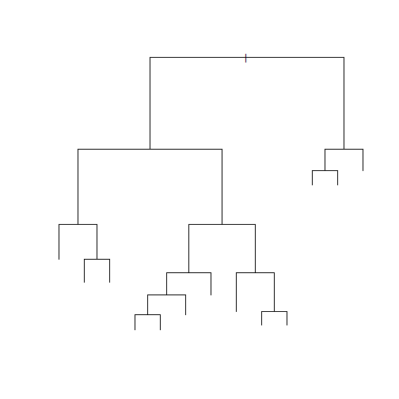
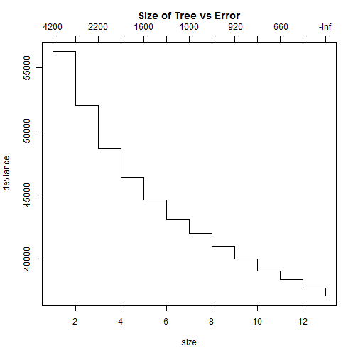

###Synopsys


The goal of this project is to predict the "classe" variable that defines the manner in which 6 participants did the exercise. For this purpose data from accelerometers on the belt, forearm, arm, and dumbell were analyzed.After cleaning and preprocessing data output was trained agains 28 predictors. There were 2 models were applied -  tree and linear discriminant analysis. The best model is "lda" model. It makes predictions with accuracy around 0.98.


###Data Processing


```r
library(caret);library(tree);library(randomForest);library(plyr);library(dplyr)
library(MASS)
cache = TRUE
data<-read.csv("pml-training.csv")
datatst<-read.csv("pml-testing.csv")
dm <- dim(data)
tstclass <- "classe"  %in%  names(datatst)

for(i in 1:length(names(data))){
    b<-(data[,i])
    b[as.character(b) =="#DIV/0!"| as.character(b)==""]=NA
    data[,i] = b}

exfeat<- NULL
for (i in 1:length(names(data))){ 
    if(sum(is.na(data[,i]))/length(data[,i])>0.75){
        exfeat<- c(exfeat,i)
        }
    }
data1 <- data[,-exfeat]
datatst1 <- datatst[,-exfeat]

dm1 <- dim(data1)
count <- length(exfeat)
output<-which(names(data1)=="classe")
for (i in 3:(length(names(data1))-1)){  data1[,i]= as.numeric(data1[,i])}
for (i in 3:(length(names(datatst1))-1)){  datatst1[,i]= as.numeric(datatst1[,i])}
```
The original training data set contains 19622 observations of 160  variables. The data set  "pml-testing.csv" does not contain "classe" column and can't be used for evaluation models.
The following figure shows histogram of variable "classe" in training data set. 


```r
#create histogram of classes
fig1<-data%>% group_by(classe) %>% summarise(totalclass = n())
ggplot(fig1, aes(x=classe, y=totalclass, fill = classe)) +
    geom_bar(stat="identity")+theme(axis.text.x = element_text(angle = 0,hjust = 1))+
   xlab("Class") +ylab("Total execises of each class")+ ggtitle ("Histogram of classes of exercises ")
```

 


100 columns contain more than 75% 'NA' values. 
After excluding these variables, the data set contains 60  varibles.
Split the training data set into the training, validation and testing sets to evaluate the model.


```r
set.seed(35)
inTrain<-createDataPartition(y=data1$classe,p=0.95,list = FALSE)
trainvalid<-data1[inTrain,]
trainVal <- createDataPartition(trainvalid$classe,p=0.95,list = FALSE)
training<-trainvalid[trainVal,]
valid <- trainvalid[-trainVal,]
test<-data1[-inTrain,]
```

Choose the least amount of predictors using "principal component analysis" and "near zero variance" methods that could capture 95% if the variation in data.


```r
pc<-preProcess(training[,-output], method = c("nzv","pca"), thresh = 0.95)
pcacmp <-pc$numComp
```

27  components are needed to capture 95 % of the variation in data
Compute new variables for 27 principal components for the data sets for building and evaluating a model


```r
trainpc<-predict(pc, training[,-output])
validpc<-predict(pc, valid[,-output])
testpc<-predict(pc, test[,-output])

#create models
#tree
models <- NULL
tr <- tree(training$classe ~., data = trainpc)
plot(tr, main = "Plot of Tree Model")
```

 

```r
trpr <- prune.tree(tr)
plot(trpr, main = "Size of Tree vs Error\n")
```

 

```r
#predict on the validation data set
predvalid<- predict(tr, newdata = validpc, type = "class")
#calculate accuracy for validation set
errortr <-sum(predvalid==valid[,output])/length(predvalid)
models<-c(models,tr)

#linear discriminant analysis model
lda <- train(training$classe~.,data = trainpc, method="lda")
#predict on the validation data set
predvallda<-predict(lda, newdata = validpc, type = "raw")
#calculate accuracy for the validation set
errorlda <-sum(predvallda==valid[,output])/length(predvallda)
models<-c(models,lda)
modelaccur<-c(errortr, errorlda)

names(models)<-c("tree","lda")

bestmodel<-names(models)[which(modelaccur == max(modelaccur))]
#test the best model on the testing data set
testpred<-predict(lda, newdata = testpc, type = "raw")
accurtst<-sum(testpred==test[,output])/length(test[,output])
```

According to analysis, the best model is lda. Calculated accuracy on the testing 
data set is 0.9826353
 Confusion matrix for the best model for the test data set:


```r
confusionMatrix(test$classe, testpred)
```

```
## Confusion Matrix and Statistics
## 
##           Reference
## Prediction   A   B   C   D   E
##          A 275   4   0   0   0
##          B   1 187   1   0   0
##          C   0   1 170   0   0
##          D   0   0   1 155   4
##          E   0   0   0   5 175
## 
## Overall Statistics
##                                           
##                Accuracy : 0.9826          
##                  95% CI : (0.9723, 0.9899)
##     No Information Rate : 0.2819          
##     P-Value [Acc > NIR] : < 2.2e-16       
##                                           
##                   Kappa : 0.978           
##  Mcnemar's Test P-Value : NA              
## 
## Statistics by Class:
## 
##                      Class: A Class: B Class: C Class: D Class: E
## Sensitivity            0.9964   0.9740   0.9884   0.9688   0.9777
## Specificity            0.9943   0.9975   0.9988   0.9939   0.9938
## Pos Pred Value         0.9857   0.9894   0.9942   0.9688   0.9722
## Neg Pred Value         0.9986   0.9937   0.9975   0.9939   0.9950
## Prevalence             0.2819   0.1961   0.1757   0.1634   0.1828
## Detection Rate         0.2809   0.1910   0.1736   0.1583   0.1788
## Detection Prevalence   0.2850   0.1931   0.1747   0.1634   0.1839
## Balanced Accuracy      0.9953   0.9857   0.9936   0.9813   0.9857
```
 
